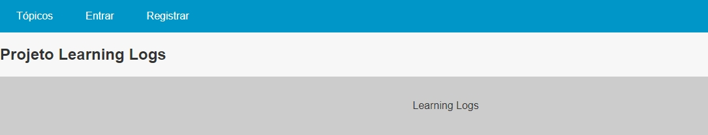
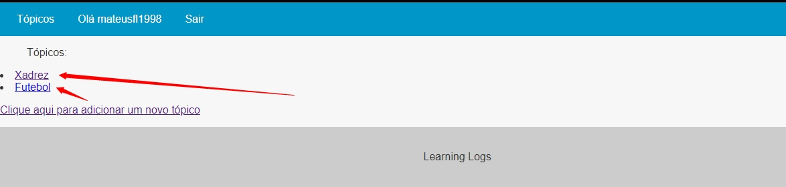
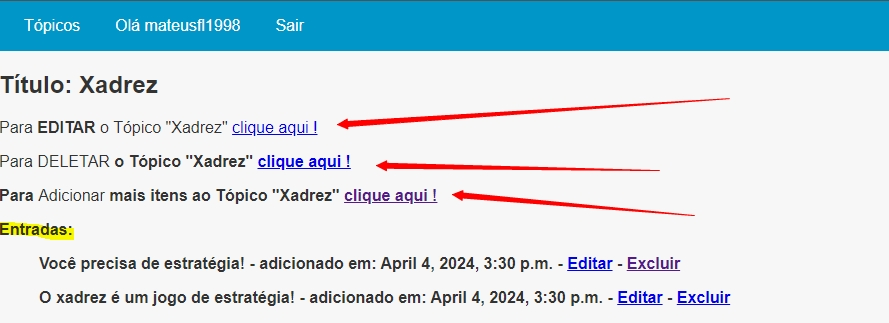
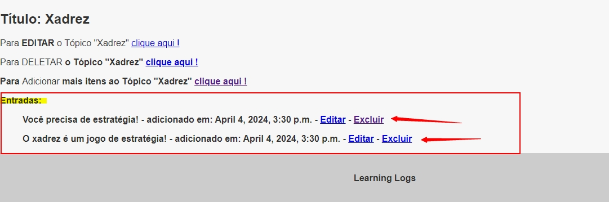

# Projeto Learning Logs

Simples projeto para estudo e prática de operacões de CRUD e Foreign Keys.

## Como usar
1 - Clone o repositório

~~~python
git clone https://github.com/mateusfl1998/Learning_Logs
~~~

2 - Crie um ambiente virtual

~~~python
python -m venv venv
~~~

3 - Ative o ambiente virtual

~~~python
venv/Scripts/activate
~~~

4 - Instale os requisitos 

~~~python
pip install -r requeriments.txt
~~~

5 - Rode a aplicação

~~~python
python manage.py runserver
~~~ 

## Conhecendo o Projeto

**Página principal:**

**Após ter realizado o registro, clique em Tópicos e veja todos os Tópicos!**

Aqui mostra todos os tópicos que eu tenho adicionados! 

**Se eu clicar em algum tópico, ele vai me mostrar as opções de "Edição", "Deletar!" e adicionar mais registro ao respectivo Tópico.**

**Mais abaixo tem todos os registros relacionado ao tópico, cada um com opção de editar e excluir!**

